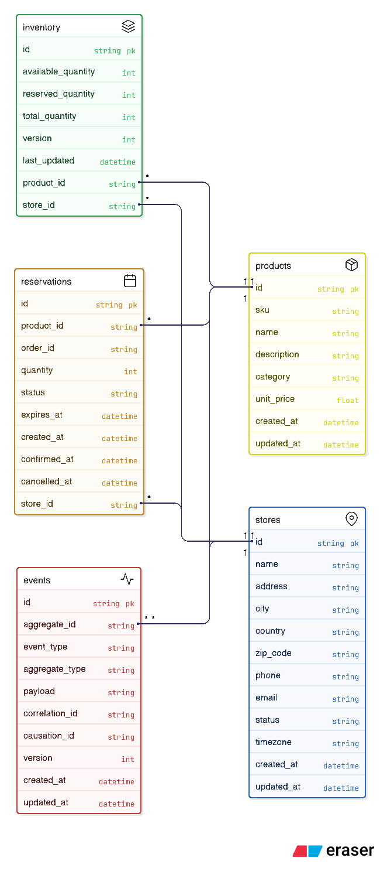

# 🧱 Sistema Distribuido de Gestión de Inventario

## 📘 Descripción General

Este proyecto propone una **arquitectura distribuida basada en eventos** para un sistema de gestión de inventario diseñado para reducir la latencia, mejorar la consistencia de los datos y aumentar la mantenibilidad y escalabilidad del sistema.

Cada tienda mantiene su **propia base de datos local** y **publica mensajes** cada vez que ocurre una actualización de stock.  
La **base de datos central de inventario** se suscribe a estos eventos para realizar actualizaciones en tiempo real, asegurando que la información de stock se mantenga consistente en todo el sistema.

Este enfoque reduce significativamente la latencia de sincronización en comparación con un modelo tradicional de sincronización cada 15 minutos.

Para fines de demostración, en el proyecto se utilizó **Redis Pub/Sub** para simular la propagación de eventos en tiempo real debido a su simplicidad y facilidad de configuración.  
Sin embargo, la implementación está diseñada de manera **abstracta**, permitiendo utilizar cualquier broker de mensajería o bus de eventos (por ejemplo, Kafka o RabbitMQ).

---

## 🗄️ Base de Datos y ORM

El prototipo utiliza **SQLite** como base de datos experimental, con datos iniciales cargados mediante el script `seed_data.py`.

 

El sistema incluye endpoints **CRUD básicos** que simulan:
- Listado de productos  
- Gestión de tiendas  
- Consultas de inventario  
- Operaciones de reserva, confirmación y cancelación  


---

## ⚙️ Resumen de Arquitectura

- **Modelo basado en eventos** que conecta las bases locales de las tiendas con el servicio central de inventario  
- **Redis Pub/Sub** como broker de eventos  
- **Distributed Locking con Redis** para garantizar consistencia ante operaciones concurrentes  
- **Optimistic locking** como medida adicional para detectar y evitar condiciones de carrera  
- **Middleware** para:
  - Registro y trazabilidad de errores  
  - Exportación de métricas hacia herramientas de observabilidad (ej. Prometheus, Grafana)  

---

## 🧩 Manejo de Consistencia y Concurrencia

El sistema prioriza la **Consistency over availability**, asegurando precisión en los datos de stock incluso si eso implica pequeños retrasos temporales en las actualizaciones.

Para prevenir **sobreventa** y manejar **reservas concurrentes**, se implementan dos mecanismos complementarios:

1. **Distributed locking (Redis Locking)**  
   Evitan que múltiples clientes modifiquen simultáneamente el mismo registro de stock.  
   Introducen una latencia mínima mientras garantizan integridad de los datos.

2. **Optimistic locking**  
   Cada registro de inventario posee un campo `version`.  
   Una actualización solo se aplica si el número de versión coincide con el actual; de lo contrario, la operación se rechaza como modificación concurrente.  
   Esto asegura que solo una transacción modifique el inventario a la vez, detectando eficazmente las condiciones de carrera.

---

## 🧱 Tolerancia a Fallos y Manejo de Errores

- Clases de **excepciones personalizadas** mantienen respuestas de error consistentes y estructuradas.  
- Es posible incorporar:
  - **Lógica de reintentos**
  - **Circuit breakers**
  - **Mecanismos de timeout**

*(Por simplicidad del challenge se omitieron en el codigo. Ademas, estas capacidades se suelen manejar desde un API Gateway o un service mesh.)*

---

## 📊 Observabilidad y Métricas

Un middleware personalizado exporta métricas que pueden integrarse fácilmente con herramientas como **Grafana** o **Prometheus**, mejorando la visibilidad y monitoreo del sistema.

---

## 📂 Estructura del Proyecto

```
hackerrank-challenge/
├── 📁 src/                          # Código fuente principal
│   ├── 📁 api/                      # Endpoints de FastAPI
│   │   ├── health.py               # Health checks y métricas
│   │   ├── inventory.py            # Operaciones de inventario
│   │   └── stores.py               # Gestión de tiendas
│   ├── 📁 config/                   # Configuración del sistema
│   │   └── event_bus_config.py     # Configuración del bus de eventos
│   ├── 📁 implementations/          # Implementaciones concretas
│   │   └── redis_event_bus.py      # Implementación Redis del bus de eventos
│   ├── 📁 interfaces/               # Interfaces abstractas
│   │   └── event_bus.py            # Contratos para EventBus, LockManager, CacheManager
│   ├── 📁 models/                   # Modelos de datos
│   │   ├── base.py                 # Modelo base con funcionalidades comunes
│   │   ├── database.py             # Modelos de base de datos (SQLAlchemy)
│   │   ├── inventory.py            # Modelos de inventario y reservas
│   │   └── store.py                # Modelos de tiendas
│   ├── 📁 schemas/                  # Esquemas de validación (Pydantic)
│   │   ├── inventory_schemas.py    # Validación de requests/responses de inventario
│   │   └── store_schemas.py        # Validación de requests/responses de tiendas
│   ├── 📁 services/                 # Lógica de negocio
│   │   ├── event_service.py        # Servicio de eventos y pub/sub
│   │   ├── inventory_service.py    # Lógica de negocio de inventario
│   │   └── store_service.py        # Lógica de negocio de tiendas
│   ├── 📁 tests/                    # Suite de tests (66 tests)
│   │   ├── test_business_logic.py  # Tests de lógica de negocio
│   │   ├── test_concurrent_updates.py # Tests de concurrencia y locking
│   │   ├── test_error_handling.py  # Tests de manejo de errores
│   │   ├── test_event_publishing.py # Tests de publicación de eventos
│   │   ├── test_fault_tolerance.py # Tests de tolerancia a fallos
│   │   └── test_metrics_logging.py # Tests de métricas y logging
│   ├── 📁 utils/                    # Utilidades y helpers
│   │   ├── database.py             # Configuración de base de datos
│   │   ├── error_utils.py          # Utilidades de manejo de errores
│   │   ├── logging.py              # Configuración de logging
│   │   ├── middleware.py           # Middleware de FastAPI
│   │   ├── prometheus.py           # Métricas de Prometheus
│   │   └── redis_client.py         # Cliente Redis
│   ├── constants.py                # Constantes del sistema
│   └── exceptions.py               # Excepciones personalizadas
├── 📁 scripts/                      # Scripts de utilidad
│   ├── reset_database.py           # Reset de base de datos
│   └── seed_data.py                # Carga de datos iniciales
├── 📁 docs/                         # Documentación
│   └── diagrama.png                # Diagrama de arquitectura
├── 📁 prompts/                      # Prompts utilizados para GenAI
│   ├── readme.txt                  # Prompt para generación de README
│   └── tests.txt                   # Prompt para generación de tests
├── 📁 data/                         # Datos persistentes
│   └── inventory.db                # Base de datos SQLite
├── 📁 logs/                         # Archivos de log
├── 📁 config/                       # Configuración adicional
│   └── settings.py                 # Configuración de la aplicación
├── 📄 main.py                      # Punto de entrada de la aplicación
├── 📄 docker-compose.yml           # Orquestación de contenedores
├── 📄 Dockerfile                   # Imagen Docker
├── 📄 requirements.txt             # Dependencias de Python
├── 📄 pytest.ini                  # Configuración de pytest
├── 📄 README.md                    # Documentación principal
├── 📄 run.md                       # Instrucciones de ejecución
├── 📄 technical-decisions.md       # Justificaciones técnicas
└── 📄 PROJECT_STATUS.md            # Estado del proyecto
```

### 🗂️ **Descripción de Carpetas Principales**

| Carpeta | Propósito |
|---------|-----------|
| **`src/api/`** | Endpoints REST de FastAPI para operaciones de inventario, tiendas y health checks |
| **`src/services/`** | Lógica de negocio central: reservas, confirmaciones, cancelaciones y gestión de stock |
| **`src/models/`** | Modelos de datos (SQLAlchemy) y esquemas de validación (Pydantic) |
| **`src/interfaces/`** | Interfaces abstractas para EventBus, LockManager y CacheManager |
| **`src/implementations/`** | Implementaciones concretas (Redis) de las interfaces abstractas |
| **`src/tests/`** | Suite completa de 66 tests unitarios cubriendo todos los aspectos del sistema |
| **`src/utils/`** | Utilidades: logging, métricas, middleware, manejo de errores y conexiones |
| **`scripts/`** | Scripts de utilidad para seeding de datos y reset de base de datos |
| **`docs/`** | Documentación técnica y diagramas de arquitectura |
| **`prompts/`** | Prompts utilizados con herramientas GenAI para desarrollo asistido |

---

## 🧰 Stack Tecnológico

Elegi Python como lenguaje de programacion por practicidad y sencilles para este challenge, ya que tengo experiencia en ambos lenguajes. Al elegir Java, la solucion hubiese sido la misma.

| Componente | Tecnología |
|-------------|-------------|
| Lenguaje | Python |
| Framework | FastAPI |
| Base de datos | SQLite |
| Broker de mensajes | Redis Pub/Sub |
| Bloqueos | Redis Distributed Locks + Bloqueo Optimista |
| Monitoreo | Prometheus / Grafana (opcional) |

---

## 🧪 Testing

El proyecto incluye una suite completa de tests que cubren todos los aspectos del sistema:

```bash
# Ejecutar todos los tests
python -m pytest src/tests/ -v

# Ejecutar categorías específicas
python -m pytest src/tests/ -m "concurrency" -v
python -m pytest src/tests/ -m "business" -v
python -m pytest src/tests/ -m "fault_tolerance" -v
python -m pytest src/tests/ -m "metrics" -v
```

### ✅ Cobertura de Tests

- **Actualizaciones Concurrentes & Locking**: Distributed locks, optimistic locking, prevención de race conditions
- **Lógica de Negocio**: Workflow de reservas, gestión de stock, validación
- **Manejo de Errores**: Manejo de excepciones, escenarios de error, validación
- **Publicación de Eventos**: Eventos en tiempo real, pub/sub, sincronización central
- **Tolerancia a Fallos**: Recuperación de errores, integridad del sistema, degradación graceful
- **Métricas & Logging**: Monitoreo de performance, tracking de errores, observabilidad

### 🎯 Características de Testing

- **Mocking**: Redis, Database, Message Broker (sin dependencias externas)
- **Tests Parametrizados**: Múltiples inputs y escenarios
- **Simulación de Concurrencia**: Testing de alta carga y race conditions
- **Inyección de Fallos**: Fallos simulados y recuperación
- **Assertions Claras**: Mensajes de error descriptivos y validación


## 🚀 Instrucciones de Ejecución

Se detallan en el **run.md**


## IA 

Herramientas como eraser y agentes como claude-sonnet y gpt-5 se usaron para la eficiencia de ciertas tareas como armado de tests unitarios, generacion de README (prototipo), generacion de Diagramas, debugs y mejora de codigo. 
Prompts usados se encuentran en carpeta **prompts**.
